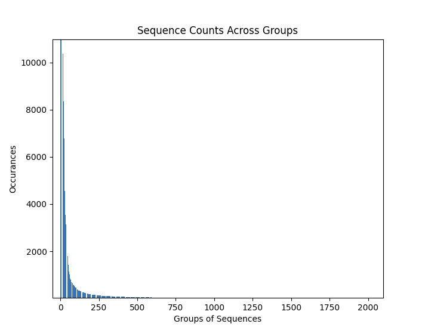

**Problem**\
> A large set of cells are virally induced with unique barcodes, such
> that the first 30 characters represent the unique barcode, and the 20
> characters after the first 32 will contain the anchor tag to identify
> induced sequences. The first 30 characters of a unique barcode may
> have variations due to sequencing errors, so we will find the true
> barcodes from the raw sequencing data.
>
**Approach**\
> - Filter for sequences that contain an anchor tag, to obtain set of
> induced sequences. - Use a clustering algorithm to group large list of
> sequences (as barcodes) by barcodes that are hamming-1 neighbors. This
> will create groups of barcodes that are at most 1 variation away from
> each other.
>
> Rank groups of barcodes with the greatest occurrence in the set of
> induced sequences-\
> - Rank barcodes for each group by greatest occurrence in the set of
> induced sequences- For the top N (number of cells) groups, identify
> the most frequent variation as a 'true barcode'
>
**Analysis**
>
> *Filter for sequences that contain an anchor tag, to obtain set of
> induced sequences.*
>
> Working with *10_6\_candidates.fastq,* a file of 1,000,000 sequences,
> we can filter the set to 824,076 sequences with the known embedded
> anchor tag.

*Use a clustering algorithm to group large list of sequences (as
barcodes) by barcodes that are hamming-1 neighbors. This will create
groups of barcodes that are at most 1 variation away from each other.*

> First implemented a manual clustering algorithm that for each barcode
> in the set, would cluster all its hamming-1 neighbors in the set then
> eject them to another array until original set empty. While it's
> correct in maintaining cluster of up to 1 variation, this would take
> 4+ hours to run for a dataset of \~800,000 sequences with an O(n2)
> time complexity. I experimented with using a k-means clustering
> algorithm which also seemingly took as long. By nature of the problem
> we are going to have to make O(n2) comparisons, so the only
> optimization was parallel processing.

> By chunking the find_neighbors job to run in parallel across partial
> sets of the original data set, I reduced the overall clustering
> runtime for the \~800k sequences dataset from hours to a few minutes.

*Rank groups of barcodes with the greatest occurrence in the set of induced sequences*

> The chart above shows the distribution of 'unique' barcodes in the
> whole dataset. 'Unique' to mean a 'true' barcode and all its variants.
> Over a set of 22k groups ('unique' barcodes), most had very low
> counts, validating the second hint, "We observe low counts for the
> vast majority of barcodes whitelisted."
>
> With the geometric distribution skewed right, and the unknown of cell
> count to determine the number of true barcodes we're looking for, I
> ranked the confidence of potentially true barcodes by the size of
> their group (number of occurrences of it and its variants) to estimate
> confidence.

*Rank barcodes for each group by greatest occurrence in the set of
induced sequences*

The chart above shows the distribution of a group's variants'
occurrences in the original dataset.

> So each variant in this group is a hamming-1 neighbor. We can see a
> similar geometrically skewed right distribution showing few
> occurrences of the neighbors of the most prevalent sequence variant.
> This validates the third hint, "The vast majority of the apparent
> barcodes are hamming-1 neighbors of other apparent barcodes." As of
> the *10_6\_candidates* dataset, we had groups with 20k+ variants, and
> of those most had very low counts and are a hamming-1 neighbor of a
> variant with a very high count.
>
> I ranked the variants by count again as to estimate confidence and
> identified the most prevalent sequence as the 'true' barcode of the
> group.
>
> *For the top N (number of cells) groups, identify the most frequent
> variation as a 'true barcode'*
>
> In this run, of 22390 potentially true barcodes, I specified to choose
> the top 10 most likely by count and confidence within their group. You
> can change this to ask for N (cell count) true barcodes, all barcodes,
> or a subset as below.

**Conclusion**\

*How do you know that your program works?*

> I'm confident in my program's correctness towards identifying
> prevalent barcodes that are most likely to be the original of any
> incorrectly sequenced barcodes, assuming they maintain a variance of 1
> (hamming-1). I've tested with assertions to ensure barcodes aren't
> dropped or lost, and that all grouped sequences are hamming-1
> neighbors. Bar any misunderstanding of how to interpret the data, my
> program works.

*How well does your program scale to larger data?*

> By nature of the clustering requirement to match unique barcodes to
> their variations, we will have to run n2comparisons, making it
> difficult to scale. My program attempts to remedy this by batching our
> comparison jobs of finding barcode variances by chunking the job
> across the large dataset of barcodes to many parallel jobs to merge
> together on return. This enables scaling to become dependent on the
> number of processes we can run on our machines.

*How easy is it to apply your program to new data, which might have
different statistics?*

> This program is setup for interactive compilation, allowing users to
> feed their own fastq datasets, number of cells (expected true
> barcodes), and the known anchor tag. So long as we keep in mind the
> assumptions of this program of substituting count and frequency for
> confidence in a set of unique barcodes mixed with sequencing errors up
> to 1 variation away, we can apply this program to estimate the best
> true barcodes in any dataset.
>
*How easily could someone else (or an automated process) run your
program?*

> Right now user's can interact with the program through the CLI and
> manually input their metadata on runtime. It would be trivial to
> package it with a web app to enable a nice UI to feed the data, run
> the job, and display.

> An automated process could run my program easily so long as it is
> labelled with respective metadata needed at runtime per dataset.
